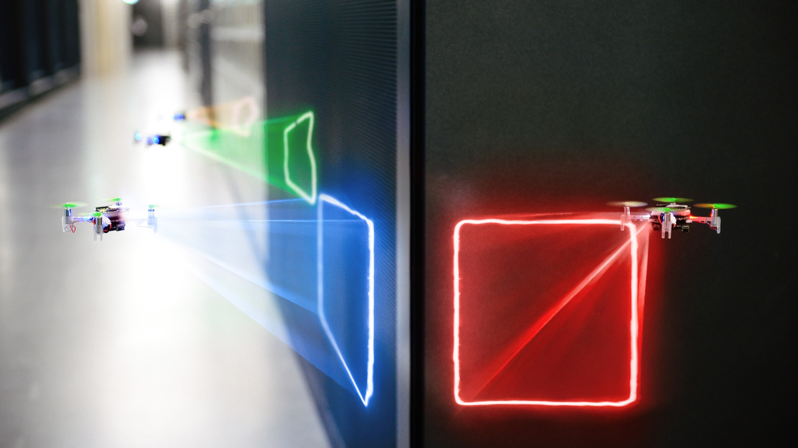
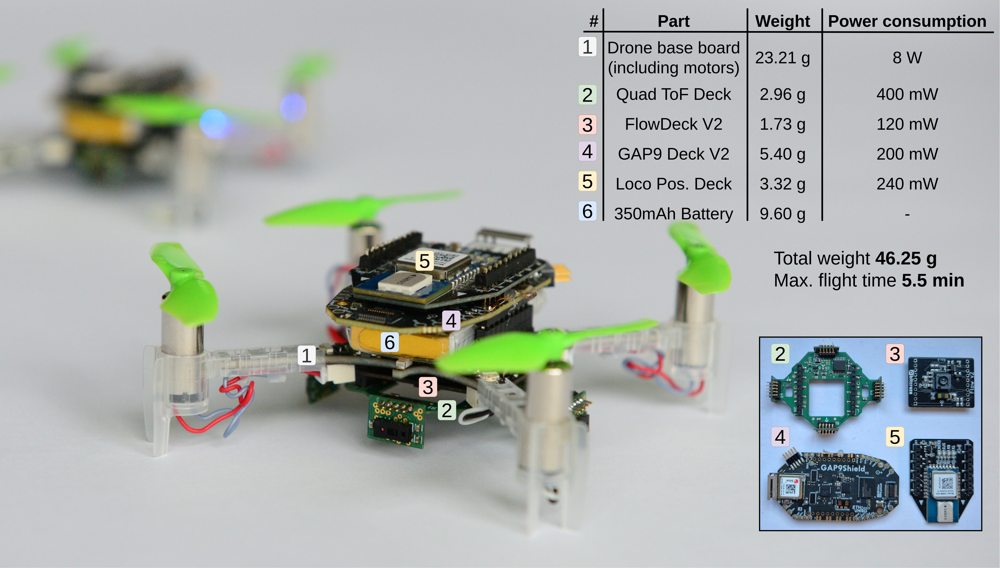

[![Contributors][contributors-shield]][contributors-url]
[![Forks][forks-shield]][forks-url]
[![Stargazers][stars-shield]][stars-url]
[![Issues][issues-shield]][issues-url]
[![License][license-shield]][license-url]

# Nano-C-SLAM: Ultra-Lightweight Collaborative Mapping for Robot Swarms

**Authors: *Vlad Niculescu*, *Tommaso Polonelli*, *Michele Magno*, *Luca Benini*** 

Corresponding author: *Vlad Niculescu* <vladn@iis.ee.ethz.ch>  



## About the Project
This work introduces a decentralized and lightweight collaborative SLAM approach that enables mapping on virtually any robot, even those equipped with low-cost hardware, including miniaturized insect-size devices. Moreover, the proposed solution supports large swarm formations with the capability to coordinate hundreds of agents. To substantiate our claims, we have successfully implemented collaborative SLAM on centimeter-size drones weighing only 46 grams. Remarkably, we achieve results comparable to high-end state-of-the-art solutions while reducing the cost, memory, and computation requirements by two orders of magnitude. Our approach is innovative in three main aspects. First, it enables onboard infrastructure-less collaborative mapping on virtually any robotic platform with a lightweight and cost-effective solution in terms of sensing and computation. Second, we optimize  the data traffic within the swarm to support hundreds of cooperative agents using standard wireless protocols such as ultra-wideband (UWB), Bluetooth, or WiFi. Last, we implement a distributed swarm coordination policy to decrease mapping latency and enhance accuracy.

## Demonstration Video
Our video briefly explains how our system works and showcases **Nano-C-SLAM** operating onboard each nano-drone in the swarm. [**Video available here**](https://www.youtube.com/watch?v=uh-Iys90agU).

## Publications
If you use **Nano-C-SLAM** in an academic or industrial context, please cite the following publication:
* *To be added later*

## Getting Started

This work was developed using the following hardware setup:
- The commercial nano-drone platform [Crazyflie 2.1](https://www.bitcraze.io/products/crazyflie-2-1/)
- The [GAP9 Deck V2](https://willl-be-provided-later) featuring the GAP9 parallel processor developed by Greenwaves Technologies.
- The custom Quad Tof Deck V2 provided in this repo (*quad-tof-deck-v2/*) which features four [VL53L5CX](https://www.st.com/resource/en/datasheet/vl53l5cx.pdf) sensors
- The commercial [Flow-Deck v2](https://www.bitcraze.io/products/flow-deck-v2/)
- The commercial [Loco Positioning Deck](https://www.bitcraze.io/products/loco-positioning-deck/)
- The [Crazyradio](https://www.bitcraze.io/products/crazyradio-2-0/) necessary to flash the drones

<p align="center">
  
</p>

### Hardware modifications
Note that minimal changes are required to adapt the hardware decks mentioned above and avoid pin conflicts.
On the *Loco Positioning Deck*, it is necessary to move the CS pin from IO1 to IO4. [See the schematics](https://www.bitcraze.io/documentation/hardware/loco_deck/loco_deck_revd.pdf)
On the *GAP9 Deck V2* connect the IO63 to the CF_GPIO1



## Description of the Code
The structure of the repo is shown below. The first four folders represent the code of the system, while the last folder represents the source files of the *Quad Tof Deck V2 * PCB.
```
.
└── Nano-C-SLAM/
    ├── cslam-stm32-app/
    ├── cslam-gap9-app/
    ├── uwb-software-library/
    ├── crazyflie-firmware/  
    └── quad-tof-deck-v2/
```

### The STM32 Firmware
The STM32 application code is found in `cslam-stm32-app/` and it is organized in four tasks:
- The *mission task* provides the green light for the mission start, dictates how often poses are acquired and validates scans. Implemented in `cslam-stm32-app/app_main.c`.
- The *flight task* runs the exploration algorithm and provides the flight commands to the drone, based on the information obtained from the ToF sensors and the positions of the other drones. Implemented in `/src/flight_commander.c`.
-  The *tof task* manages the communication with the four ToF sensors and performs data acquisition. Implemented in `/src/tof_daq.c`.
-   The *uwb ranging task* manages the radio communication with the other drones, but also the SPI communication with the GAP9. Implemented in `/src/uwb_ranging.c`.

### The GAP9 Firmware
The structure of the GAP9 application is shown below, where the folders are ordered by their importance.
```
.
└── cslam-gap9-app/
    ├── slam/
    ├── icp/
    ├── point-cloud/
    ├── spi/  
    ├── dma/  
    ├── gpio/  
    ├── unit-test/  
    └── main.c
```

Folders `slam/` and `icp/` contain the implementations of the Graph-based SLAM and ICP algorithms. In `point-cloud/` the application stores the internal pose graph and the external poses. The file `point-cloud/point_cloud.c` implements methods for deriving internal loop closure constraints (i.e., intra-drone), adding new poses to the graph and optimizing the pose graph. On the other

`spi/` implements the SPI communication driver and the SPI packet decoding. In `dma/` we implement the DMA transfer functions between the Fabric Controller and the Cluster. `gpio/` containt the IO configuratio and `unit-test/` containt a unit test to validate the functionality of the system using two drones. 

The `main.c` file manages the whole process and implements the SPI slave communication. It works as a loop, which waits until a new SPI packet is received, decodes the packet and calls the appropriate functions depending on the pakcet type. Once the pakcet processing is done, the system goes back and waits for the next packet.

## Building and Flashing the Software
### Preparing the drones
This guide shows you how to prepare, build and test a swarm of N drones, where N is chosen by the user. Firstly, prepare N drones that feature the hardware mentioned above. Then, connect the Crazyradio to the computer. For each drone change the address following the instructions from [here](https://www.bitcraze.io/documentation/repository/crazyflie-clients-python/master/userguides/userguide_client/). The default address of a Crazyflie drone is 0xE7E7E7E7E7. The addresses should be set so that the drone with ID 0 should have the address 0xE7E7E7E7EA, the drone with ID 1 should have the address 0xE7E7E7E7EB, and so on (increments of one).
 
 ### Flashing the STM32 onboard the Crazyflies
1. Clone this repository:`git clone --recurse-submodules git@github.com:ETH-PBL/Nano-C-SLAM.git`
2. Move the file `changes.patch` to `crazyflie-firmware/` and run `git apply changes.patch`
3. Go to `cslam-stm32-app/src/config_params.h` and set `NR_OF_DRONES` to N (chosen by the user)
4. Go to `cslam-stm32-app/deploy.sh` and modify the file according to how many drones are used. The script is written to accommodate four drones by default
5. Go to `cslam-stm32-app/`, turn on all drones and run `./deploy.sh`. This will flash all drones

 ### Flashing the GAP9 onboard each drone
To compile the code, you must first install the GAP9 SDK. If you don't have access to it, you can contact [GreenWaves Technologies](https://greenwaves-technologies.com/gap9-docs/). After installing the SDK and sourcing the platform through the sourceme.sh file, you can compile and flash the code by doing the following:

1. Connect the JTAG to the computer and to the GAP9 Deck V2
2. Go to `cslam-gap9-app/` and run `make all run CONFIG_BOOT_DEVICE=mram`. Perform these two steps for each drone.

### Run the mission
1. Power on the drones and place them in the environment
2. Got to `cslam-gap9-app/run_demo.py` and configure the `positions` variable with the 2D position and heading of each drone.
3. Run `python3 run_demo.py N`. The drones will start flying and mapping the environment.


<!-- MARKDOWN LINKS & IMAGES -->
<!-- https://www.markdownguide.org/basic-syntax/#reference-style-links -->

[contributors-shield]: https://img.shields.io/github/contributors/ETH-PBL/NanoSLAM.svg?style=flat-square
[contributors-url]: https://github.com/ETH-PBL/NanoSLAM/graphs/contributors
[forks-shield]: https://img.shields.io/github/forks/ETH-PBL/NanoSLAM.svg?style=flat-square
[forks-url]: https://github.com/ETH-PBL/NanoSLAM/network/members
[stars-shield]: https://img.shields.io/github/stars/ETH-PBL/NanoSLAM.svg?style=flat-square
[stars-url]: https://github.com/ETH-PBL/NanoSLAM/stargazers
[issues-shield]: https://img.shields.io/github/issues/ETH-PBL/NanoSLAM.svg?style=flat-square
[issues-url]: https://github.com/ETH-PBL/NanoSLAM/issues
[license-shield]: https://img.shields.io/github/license/ETH-PBL/NanoSLAM.svg?style=flat-square
[license-url]: https://github.com/ETH-PBL/NanoSLAM/blob/master/LICENSE
[product-screenshot]: pics/drone.png

